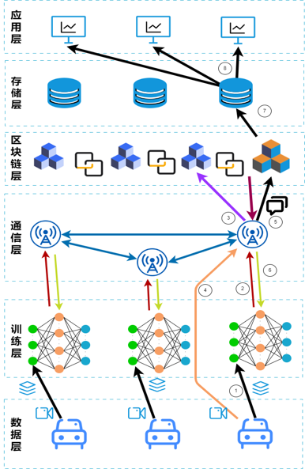
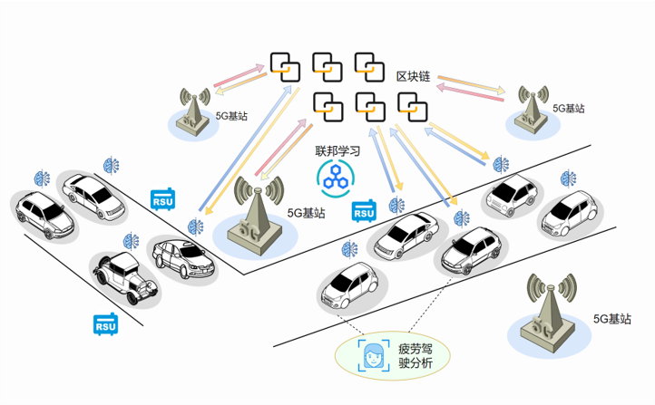

# SoftwareArchitecture

## 区块链融合联邦学习的可信智能车联网系统  

### 1、简介
  
- 如今万物互联、汽车产业迅速发展的时代，工信部印发了《关于推动5G加快发展的通知》，提出促进“5G+车联网”协同发展，推动将车联网纳入国家新型信息基础设施建设工程。然而，当前车联网场景下仍面临AI模型训练难、车辆数据共享难、数据安全保证难等行业痛点问题。本项目融合5G通信、边缘联邦智能、区块链分布式账本技术，构建数据隐私、身份可信、高可视化的分布式可信智能的车联网平台。 
- 我们设计一套区块链与联邦学习融合的边缘可信智能车联网系统，在车辆数据不离开本地的前提下，多车通过5G通信联邦训练一种基于深度学习的疲劳驾驶行为分析算法，形成一套实时、可视化的车联网AI模型训练仿真演示平台。仿真平台结果可以显示模型参数上链、区块链联邦聚合，模型参数更新等功能，联邦训练了疲劳驾驶模型中的眼部状态识别和嘴部状态识别模型，经过多轮聚合，各车模型的准确率应该有很大提升，最终能够对车内驾驶员监测视频进行实时地疲劳驾驶状态分析。
- 本作品具有良好经济效益和社会效益，以及宽阔的发展前景。5G车联网市场规模大，增长趋势稳定，产业带动性、支撑性强，同时可以带动交通智能化和产业链升级。此外，我们选定了将车联网中的疲劳驾驶检测系统作为我们的具体应用场景，将检测驾驶员是否疲劳驾驶的判断模型部署至我们设计的可信智能系统中，本系统未来可进一步搭载实现智能车联网的更多AI模型池，如路况预测与规划、驾驶策略优化；也可延展至更多行业，如车企间的模型联邦共享机制，和其他行业的AI模型与智慧能力交易平台。

### 2、项目难点

[项目三大出发点&难点]()
> **1.数据共享难**  
> **2.安全保障难**  
> **3.模型训练算力有限**

### 3、需求  
[项目需求]()
> **1.AI模型训练演示平台**   
> **2.车联网车辆疲劳驾驶检测**  

### 4、系统架构1.0
本项目整体采用**分层架构**：  
> 具体分为六层  

  

  
